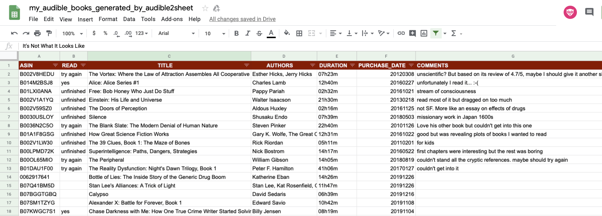
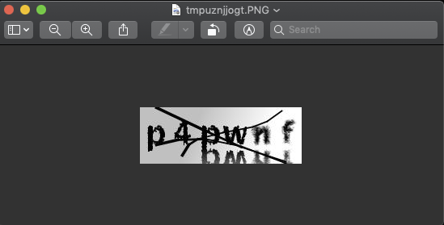

audible2sheet: your Audible library in a Google sheet!
======================================================

Script to export list of Audible books into a Google Sheet document and update **automagically** that Google Sheet as new books are added to your Audible library.

It also allows you to print your Audible library to the screen using the default fields of interest (ASIN, TITLE, AUTHORS, DURATION, PURCHASE_DATE) or any of the many fields provided by Audible (currently 80 fields, available using the -l option)).

It uses `mkb79's excellent Audible API <https://github.com/mkb79/Audible>`_.

Sample
======

Here's a `sample <https://docs.google.com/spreadsheets/d/1HC0J6K5D5oDrI5e6LyX_o5HbZwVJPqOwgz3lsSf1OJ4/edit#gid=0>`_.

(with screenshot)

Requirements
============

- Python >= 3.6
- depends on following packages:

  - audible
  - pygsheets

Installation
============
In the future....

``pip install audible2sheet``

But for now use git to clone/download the files

Also See Authentication sections

Configuration
=============
Since there are so many things that you can tweak in terms of configuration, I decided to put all that information in a configuration file instead of passing the configuration as CLI arguments

Unless specified otherwise using -c /some/other/path, the configuration file is expected to be in your homedir (~) as .audiblesheet.ini.

I provide a sample of a cfg file in audible2sheet.ini_ORIG that looks like this::

    [general]
    root_path = .audible2sheet
    # root_path = /Users/user_name/.audible2sheet

    [audible_cfg]
    # MANDATORY
    email = xxx@yyy.com
    # Not mandatory but you will be prompted for it if not specified
    password = MyK0mplXPasswd
    # Can be changed but are defaulted to the below values
    session_file_path = audible_session.txt
    # Check out the Localizations section in this page: https://github.com/mkb79/Audible
    locale = us
    library_file_path = audible_books.txt
    # Minimum length (in minutes) to be kept in the library
    min_length = 1
    # ASINS to omit in case you don't want publically show that you like the Twilight series ;-)
    # (space-separated)
    asins_to_omit =
    # Audible content to ignore (comma-separated)
    # Find available choices here: https://www.audible.com/advsr under Program Type
    # Based on my own list showing that "Product" (Audiobook?) is the most prevalent
    # Episode                 1
    # Lecture                15
    # Newspaper / Magazine    2
    # Performance            12
    # Product               602
    # Radio/TV Program        5
    # Show                    1
    # Speech                  6
    content_type_to_omit = Speech,Newspaper / Magazine
    
    [google_sheet_cfg]
    creds_file_path = audible2googlesheet.json
    sheet_name = my_audible_books_generated_by_audible2sheet
    cache_file_path = gsheet_books.txt
    # The below email must be a valid email to be used by Google Sheet to grant you read/write access to the sheet
    email = !!!change_me@gmail.com!!!

So, ``cp audible2sheet.ini_ORIG ~/.audible2sheet.ini; chmod 600 ~/.audible2sheet.ini`` and then at the very least specify your email audible email in the audible_cfg section.
If you don't want to be prompted each time, also specify your password.

If you are not in the US, change the locale as well. Check out the Localizations section in this page: https://github.com/mkb79/Audible

Authentication
==============
Audible Configuration
---------------------
In order to access your Audible library, you need to provide login and password (see configuration above) to the script in order to log in on your behalf.
The first time you do this, you will be challenged with a CAPTCHA image that looks like this:

and prompted at the command line with:

``Answer for CAPTCHA:``
   
(Note that you might be prompted more than once if you answer incorrectly)

Once the CAPTCHA has been successfully verified, your access is granted and your session is saved in your ~/.audible2sheet/audible_session.txt file unless specified otherwise in the configuration file.

Finally, your locale ("us" by default) can be specified if you live outside the US.
Check out the Localizations section in this page: https://github.com/mkb79/Audible

Once your session has been established you no longer need to specify your email or password until the session expires. It seems to expire after few hours at this point.

Google Sheets Configuration
---------------------------

Follow the instructions here:
https://pygsheets.readthedocs.io/en/stable/authorization.html
(More specifically the top of the "Authorizing pygsheets" section)

Then the "Service Account" section which is what is used in this in Audible2sheet:
https://pygsheets.readthedocs.io/en/stable/authorization.html#service-account

The downloaded .json file must be placed here ``~/.audible2sheet/audible2googlesheet.json`` unless specified otherwise in the configuration file.

Note that the standard columns that audible2sheet creates for you are:
    * ASIN
    * TITLE
    * AUTHORS
    * DURATION
    * PURCHASE_DATE

Feel free to remove any of them except **ASIN** which is used as a key to determine if any book is missing in the sheet.

You can also shuffle the order of the columns as long the column header names remain the same as above.

You can also add new columns that you want to manage yourself like whether you read the book and when, your rating of the book, etc...

Usage
=====
Just print the list of books to the screen:

``audible2sheet.py``

If you don't specify your Audible password in the cfg file, you will be prompted for it with:

``Please enter your Audible password:``

You can redirect it to a file of your choosing

``audible2sheet.py > audible_books.txt``

Just print/use the list of books that was previously fetched from Audible (from cache file)

``audible2sheet.py -a``

Create/update your Google Sheet with the list of books from Audible

``audible2sheet.py -g``

Show the books  retrieved from Audible in JSON format (useful for debugging)

``audible2sheet.py -r``

Show the books retrieved from Audible in |-separated format

``audible2sheet.py -R "asin title authors narrators"``

Show all the fields available from Audible

``audible2sheet.py -l``

Show the help/usage:

``audible2sheet.py -h``

Currently::

  usage: audible2sheet.py [-h] [-c CFG_FILE] [-r] [-R PRINT_SPECIFIC_RAW_DATA]
                          [-l] [-L LIST_VALUES_OF_SPECIFIED_FIELD] [-g] [-a]
                          [-A] [-f ASIN_FILTER] [-v]
  
  Pull Audible library books and output them to the screen or to a Google Sheet.
  The list of books to the screen/STDOUT is "|"-separated
  
  optional arguments:
    -h, --help            show this help message and exit
    -c CFG_FILE, --cfg_file CFG_FILE
                          Configuation file (default:
                          /Users/jerome/.audible2sheet.ini)
    -r, --print_raw_data  Print the raw data as returned by Audible (default:
                          False)
    -R PRINT_SPECIFIC_RAW_DATA, --print_specific_raw_data PRINT_SPECIFIC_RAW_DATA
                          Print the specified raw data column (space-separated)
                          as returned by Audible (default: None)
    -l, --list_raw_data_fields
                          List all the raw data fields as returned by Audible
                          (default: False)
    -L LIST_VALUES_OF_SPECIFIED_FIELD, --list_values_of_specified_field LIST_VALUES_OF_SPECIFIED_FIELD
                          List all the values associated with the raw data
                          specified field (default: None)
    -g, --google_sheet_export
                          Export the Audible book list to the Google Sheet
                          specified in the configuration file. (default: False)
    -a, --use_audible_cache_file
                          Use Audible cache file instead of requesting the data
                          (default: False)
    -A, --use_audible_raw_cache_file
                          Use Audible raw cache file instead of requesting the
                          data (default: False)
    -f ASIN_FILTER, --asin_filter ASIN_FILTER
                          Ignore all books except the one with the specified
                          ASIN (default: None)
    -v, --verbose         Verbose output to show addditonal information
                          (default: False)

Notes
=====
I'm purposely omitting "books" that have a zero-length and "books" of type "Speech" and "Newspaper / Magazine".

That can be tweaked in the configuration file.

✨🍰✨
